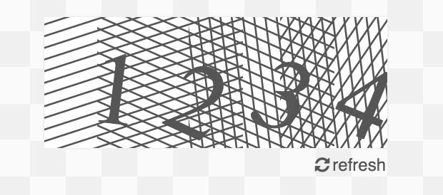

apeman-react-captcha
==========

<!---
This file is generated by ape-tmpl. Do not update manually.
--->

<!-- Badge Start -->
<a name="badges"></a>

[![Build Status][bd_travis_shield_url]][bd_travis_url]
[![Code Climate][bd_codeclimate_shield_url]][bd_codeclimate_url]
[![Code Coverage][bd_codeclimate_coverage_shield_url]][bd_codeclimate_url]
[![npm Version][bd_npm_shield_url]][bd_npm_url]

[bd_repo_url]: https://github.com/apeman-react-labo/apeman-react-captcha
[bd_travis_url]: http://travis-ci.org/apeman-react-labo/apeman-react-captcha
[bd_travis_shield_url]: http://img.shields.io/travis/apeman-react-labo/apeman-react-captcha.svg?style=flat
[bd_license_url]: https://github.com/apeman-react-labo/apeman-react-captcha/blob/master/LICENSE
[bd_codeclimate_url]: http://codeclimate.com/github/apeman-react-labo/apeman-react-captcha
[bd_codeclimate_shield_url]: http://img.shields.io/codeclimate/github/apeman-react-labo/apeman-react-captcha.svg?style=flat
[bd_codeclimate_coverage_shield_url]: http://img.shields.io/codeclimate/coverage/github/apeman-react-labo/apeman-react-captcha.svg?style=flat
[bd_gemnasium_url]: https://gemnasium.com/apeman-react-labo/apeman-react-captcha
[bd_gemnasium_shield_url]: https://gemnasium.com/apeman-react-labo/apeman-react-captcha.svg
[bd_npm_url]: http://www.npmjs.org/package/apeman-react-captcha
[bd_npm_shield_url]: http://img.shields.io/npm/v/apeman-react-captcha.svg?style=flat
[bd_bower_badge_url]: https://img.shields.io/bower/v/apeman-react-captcha.svg?style=flat

<!-- Badge End -->


<!-- Description Start -->
<a name="description"></a>

apeman react package for captcha component.

<!-- Description End -->


<!-- Overview Start -->
<a name="overview"></a>


<!-- Overview End -->


<!-- Sections Start -->
<a name="sections"></a>

<!-- Section from "doc/guides/01.Installation.md.hbs" Start -->

<a name="section-doc-guides-01-installation-md"></a>
Installation
-----

```bash
$ npm install apeman-react-captcha --save
```


<!-- Section from "doc/guides/01.Installation.md.hbs" End -->

<!-- Section from "doc/guides/02.Demo.md.hbs" Start -->

<a name="section-doc-guides-02-demo-md"></a>
Demo
-----

[Live demo][demo_url] is hosted on GitHub Pages.

[][demo_url]

[demo_url]: http://apeman-react-labo.github.io/apeman-react-captcha/demo/demo.html


<!-- Section from "doc/guides/02.Demo.md.hbs" End -->

<!-- Section from "doc/guides/03.Usage.md.hbs" Start -->

<a name="section-doc-guides-03-usage-md"></a>
Usage
---------

```jsx
"use strict";

import React from 'react';
import {ApCaptcha, ApCaptchaStyle} from 'apeman-react-captcha'
)
;

let ExampleComponent = React.createClass({
    getInitialState() {
        return {
            captchaSrc: "./captcha.svg"
        }
    },
    render() {
        let s = this,
            state = s.state;
        return (
            <div>
                <ApCaptchaStyle scoped></ApCaptchaStyle>
                <ApCaptcha src={state.captchaSrc}
                           refreshText="refresh"
                           onRefresh={s.refreshCaptcha}/>
            </div>
        )
    },
    refreshCaptcha() {
        let s = this;
        let time = new Date().getTime();
        console.log('refreshCaptcha:', time);
        s.setState({
            captchaSrc: `./images/mock-captcha.svg?t=${time}`
        })
    }
});

```


<!-- Section from "doc/guides/03.Usage.md.hbs" End -->

<!-- Section from "doc/guides/04.Components.md.hbs" Start -->

<a name="section-doc-guides-04-components-md"></a>
Components
-----

### ApCaptcha

**Props**

| Name | Type | Default | Description |
| ---- | ---- | ------- | ----------- |
| src | string | null | Captcha image url |
| onRefresh | function | null | Handle image refresh |
| refreshIcon | string | "fa fa-refresh" | Refresh icon class |
| refreshText | string | "" | Refresh text |


### ApCaptchaSvg

SVG captcha.

DO NOT use svg base captcha in production, since it may be parsable by bots.
You need to convert to bitmap like png beforehand.

**Props**

| Name | Type | Default | Description |
| ---- | ---- | ------- | ----------- |
| version | string | '1.1' | SVG version |
| text | string| null | Text to render |


### ApCaptchaStyle

**Props**

| Name | Type | Default | Description |
| ---- | ---- | ------- | ----------- |
| scoped | bool | false | Render as scoped style. |
| style | object | {} | Style object. |


<!-- Section from "doc/guides/04.Components.md.hbs" End -->


<!-- Sections Start -->


<!-- LICENSE Start -->
<a name="license"></a>

License
-------
This software is released under the [MIT License](https://github.com/apeman-react-labo/apeman-react-captcha/blob/master/LICENSE).

<!-- LICENSE End -->


<!-- Links Start -->
<a name="links"></a>

Links
------

+ [apeman](https://github.com/apeman-labo/apeman)
+ [apeman-react-labo](https://github.com/apeman-react-labo)
+ [React](https://facebook.github.io/react/)

<!-- Links End -->
